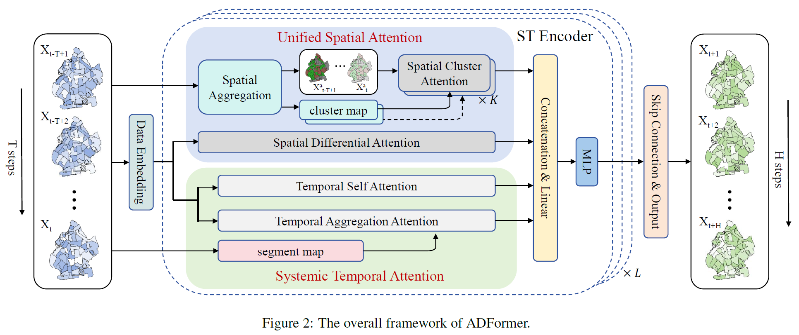

This repository provides the implementation code for our paper: *ADFormer: Aggregation Differential Transformer for Passenger Demand Forecasting*.

The following is a detailed description of each folder.
## data
`geo/taxi_zones` contains files that indicate geographic information of NYC, which can be used to plot map. 
Similarly, `xian_hexAddr.txt` includes hexagonal grid addresses of Xi'an, which can be mapped to real-world latitude and longitude. 
These files, like `NYC_Taxi_origin.pkl` and `NYC_Taxi_destination.pkl`, are stored as 2D arraies. The first dimension is the number of spatial units and the second is the number of timesteps. They are used to generate input data in `utils/ADFormer_dataset.py`.
